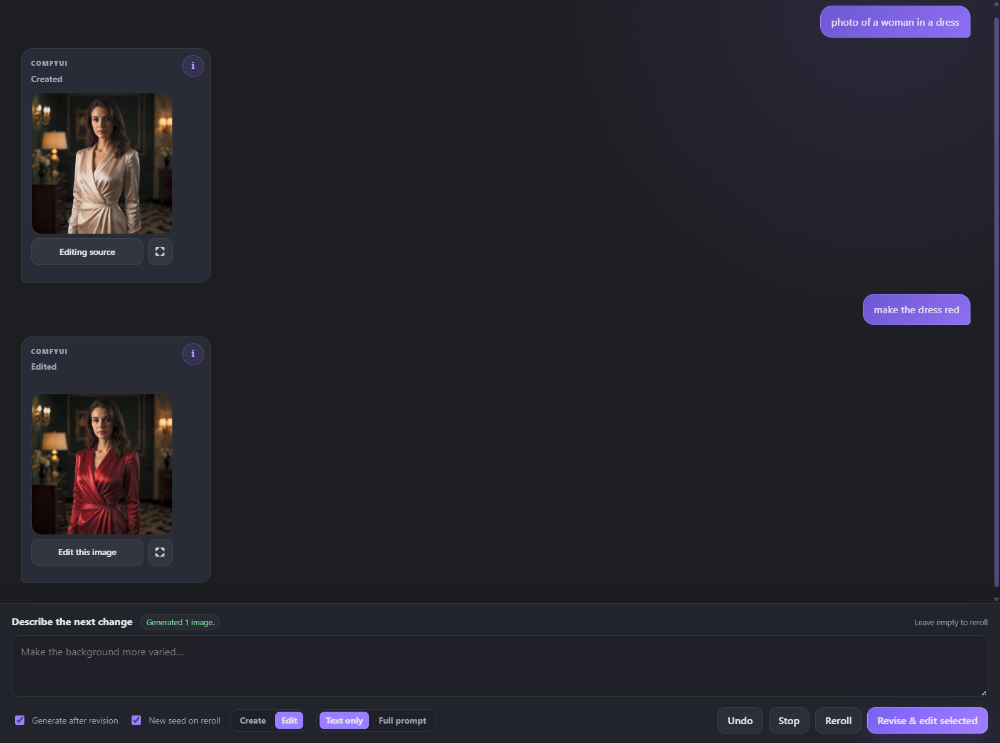

# ComfyUI_PromptStudio

Create, refine, edit, and upscale ComfyUI images in a chat-first studio powered by your local KoboldCpp or Ollama model.

## Browser setup wizard

The source-readable Windows setup wizard is under `installer/`. Double-click
`Start Prompt Studio Setup.vbs`; it opens a private loopback browser wizard with no terminal
window. The wizard can use an existing ComfyUI or install an official portable NVIDIA, AMD,
or Intel build, install or safely update Prompt Studio, add the bundled `[PS] - Krea2 Turbo`
workflow, and acquire every missing model with resumable SHA-256-verified downloads. Existing
workflows and Prompt Studio installs receive rollback backups before replacement.

For fresh Windows environments, the review also includes the Microsoft Visual C++ v14 x64
runtime when its required DLLs are absent. Setup downloads the current Microsoft permalink,
requires a valid Microsoft Authenticode signature, requests Windows elevation, and installs the
runtime before ComfyUI starts. The official portable archive already bundles Python, PyTorch,
ComfyUI's Python packages, and its frontend; a compatible GPU driver remains the only
hardware-specific system prerequisite.

The same flow detects KoboldCpp and Ollama, or installs the official standalone Ollama runtime
and a hardware-appropriate Qwen3-VL model. On a single GPU, Ollama unloads the LLM immediately
after prompt work so ComfyUI can reclaim VRAM; on multi-GPU systems, the wizard recommends the
second GPU for the LLM. A source-readable `Start Prompt Studio.vbs` launcher keeps background
services hidden, starts ComfyUI in a normal visible terminal, waits for it to become ready, and
opens the finished Studio with the chosen provider and model already selected.

## Create and revise images through conversation

Describe what you want, generate it through any compatible saved ComfyUI workflow, then ask for focused changes in plain language. Prompt Studio preserves established details while updating the image and prompt together.



## Let Prompt Agent iterate for you

Give the vision-capable Prompt Agent a goal and optional reference images. It writes a prompt, generates, judges the actual pixels, refines weak points, and keeps the best result for you to promote into Studio.

<!-- Screenshot slot: autonomous Prompt Agent iterations and scores.
Suggested file: docs/images/prompt-agent.png

-->

## Bring your own ComfyUI workflows

Turn saved `[PS]` workflows into creation, image-editing, and upscaling templates. Prompt Studio can expose workflow-owned models, LoRAs, resolution controls, and source images without replacing the graph you already use.

<!-- Screenshot slot: workflow, model, LoRA, and resolution controls.
Suggested file: docs/images/workflow-controls.png

-->

## Keep every experiment reproducible and local

Independent sessions retain prompts, images, controls, and complete executable workflow snapshots. Restore an earlier result, rerun its saved inputs, or consult your local model without sending the conversation to a hosted service.

<!-- Screenshot slot: sessions plus a generated image's saved-input inspector.
Suggested file: docs/images/sessions-and-replay.png

-->

## Continue in Video Studio

When the companion `PromptStudio_Video` extension is installed, send a generated image directly into an open video project as a MiniMax reference or frame and continue building on the same visual idea.

<!-- Screenshot slot: Send to Video Studio action and completed handoff.
Suggested file: docs/images/video-studio-handoff.png

-->

The sections below cover setup, everyday use, workflow contracts, nodes, presets, security, and APIs in depth.

## Quick start: generate images through chat

1. Install this repository in `ComfyUI/custom_nodes/ComfyUI_PromptStudio` and restart ComfyUI.
2. Add a **KoboldCpp Prompt Slot** or **KoboldCpp Prompt Amplify** node to an image-generation workflow.
3. Connect its `prompt` output to the positive prompt input or text encoder used by the workflow.
4. Make sure the rest of the workflow can be queued normally and has exactly one image output.
5. Save it in ComfyUI with a filename beginning `[PS]`, such as `[PS] Flux Create`.
6. Use one of the launchers at the lower-right of ComfyUI:
   - **Prompt chat** opens the embedded interface.
   - **Prompt Studio** opens the same interface in its own tab.
7. Select the saved workflow under **ComfyUI workflows** in Prompt Studio settings, then describe the image you want.
8. Click **Create & Generate**. After the first result, ask for changes such as `use a wider composition`, `replace the coat with a red rain jacket`, or `make the lighting softer`.

Prompt Studio uses KoboldCpp at `http://localhost:5001` by default. Open Prompt Studio settings to select **KoboldCpp** or **Ollama** as the LLM provider. Ollama defaults to `http://localhost:11434`; select one of the locally installed models discovered from `/api/tags`. For safety, both providers accept loopback hosts only by default.

**Settings → General → Keep models loaded** is off by default. In this shared-GPU mode, Prompt Studio keeps ComfyUI's models resident after image generation so reruns and already-queued work remain fast. Only when the next LLM operation begins does it wait for the ComfyUI queue to become idle, unload ComfyUI's models, and free its allocator cache. The LLM remains available across routing, rewriting, discussion, and consultation stages; immediately before Prompt Studio queues another ComfyUI workflow, it unloads the active LLM and hands the GPU back to ComfyUI. This transition is serialized so background LLM work cannot overlap ComfyUI inference on the shared device.

Enable **Keep models loaded** only when ComfyUI and the LLM use separate GPUs. It disables both sides of the handoff and asks Ollama to keep its selected model resident indefinitely. Enabling it while both services use the same full GPU can cause an out-of-memory failure.

Shared-GPU KoboldCpp operation requires KoboldCpp Admin Mode and an Admin Directory. Prompt Studio uses the admin API to switch to `unload_model`, then restores `initial_model` before the next LLM request. If KoboldCpp has an Admin Password, set it in ComfyUI's environment before startup:

When a shared-GPU handoff fails, the system-status dot turns red and the provider detail shows the handoff error. The warning remains visible across status polling until that provider completes a handoff successfully; enabling **Keep models loaded** hides handoff-only warnings because no model switch is required.

```powershell
$env:PROMPT_STUDIO_KOBOLD_ADMIN_PASSWORD = "your-admin-password"
```

**Settings → General → LLM Profiles** stores model-specific thinking, response-token, sampler,
stop-sequence, and request-timeout values. The shipped editable profiles are **Qwen3.5** and
**Qwen 3.8 (27B)**; the latter stores Unsloth's separate recommended sampler values for thinking
and non-thinking operation and switches between them from the Generation controls' Thinking selector. Profiles can
be added, renamed, edited, restored to their shipped parameter defaults, or deleted. When no user
profiles remain, Prompt Studio exposes an immutable **Default** profile with the shipped values so
local-LLM features remain usable. The selected profile is shared by prompt rewriting, local model
chat, image discussion, and Prompt Agent.

For **Qwen 3.8 (27B)**, Disabled thinking uses temperature `0.7`, `top_p` `0.8`, `top_k` `20`,
`min_p` `0`, presence penalty `1.5`, and repetition penalty `1.0`. Any enabled thinking level uses
temperature `1.0`, `top_p` `0.95`, `top_k` `20`, `min_p` `0`, presence penalty `0`, and repetition
penalty `1.0`. Both sampler groups remain editable in the profile dialog.

Prompt rewriting uses KoboldCpp's OpenAI-compatible Chat Completions endpoint and the model's native GGUF chat template. Enable **Use Jinja** in KoboldCpp and restart its server after changing that setting. The backend checks this capability and stops with a clear error instead of silently using generic chat formatting. KoboldCpp 1.117.1 or newer is recommended and is the version used for integration testing.

With Ollama selected, Prompt Studio uses Ollama's native, non-streaming `/api/chat` endpoint. Sampling controls are translated to Ollama options, and the Thinking control uses Ollama's separate `think` response channel. **Minimal** and **Low** both request Ollama's `low` thinking level. If a constrained model spends the initial routing budget on reasoning, Prompt Studio retries that decision once with Thinking disabled and displays a warning instead of failing the Studio turn. A non-structured response that reaches its limit but contains usable text is retained with an incomplete-result warning. In shared-GPU mode Ollama stays loaded briefly across related LLM stages and is explicitly unloaded at the LLM-to-ComfyUI transition. The ComfyUI canvas nodes remain named KoboldCpp Prompt Slot/Amplify for workflow compatibility; in interactive Prompt Studio, they act as prompt handoff nodes and the provider selected in settings performs the rewrite.

> Want to use the chat UI without an LLM? Turn off **Use LLM amplification**. The composer becomes a direct-prompt editor, the main and final prompts stay identical, and **Generate** sends that text straight to ComfyUI.

## The interactive workflow

### Create, revise, and inspect

The first creation instruction becomes the main prompt and is rendered into a complete final prompt. Later change instructions are treated as revisions rather than as a transcript for the prompt editor. Prompt Studio precision-revises the model-neutral main prompt and the existing detailed final prompt separately, preserving unrelated established detail.

Revisions use the smallest edit scope implied by the request. References that conflict with the requested change are replaced, while unrelated clauses and tags are preserved where possible. Removing an automatic detail that is absent from the main prompt changes only the final prompt; Prompt Studio does not add negative wording to the main prompt.

The main composer can also discuss the latest completed generated image. A short intent-routing pass distinguishes direct creation or revision requests from questions, exploration, confirmations, and cancellations. Questions open a session-persistent image discussion grounded in the generated pixels, the prompts and saved workflow inputs that produced them, and any pasted visual reference. The assistant may offer one structured **Suggested prompt change**; applying it, or replying with a clear confirmation such as “Okay, let’s do it,” sends that model-neutral change through the normal paired main/final precision-revision pipeline. Discussion alone never changes prompts or generation controls.

Pasted references remain pinned while that image discussion is active. Prompt Studio sends the generated result as the target and uploaded images as separately labelled visual references, so the model can compare relevant traits without guessing which image should be changed. If the target generation, prompts, or prompt-shaping controls change before a suggestion is applied, the suggestion is marked stale and must be discussed again against the current result. Suggested changes may update the prompt and allow-listed Studio controls such as Secondary instructions, style and framing controls, embellishment, target length, resolution, and seed behavior. The proposal card names every control that Apply will change. Workflows, diffusion models, LoRAs, samplers, schedulers, steps, CFG, and arbitrary workflow-node inputs are never changed automatically.

After a generation completes, the main composer offers an optional **Use latest image for LLM**
toggle. It sends the newest completed generated image alongside prompt rendering and revision
requests, giving a vision-capable local model direct visual context for instructions such as
“correct the pose” or “keep everything else the same.” The option is off by default, is unavailable
until the current session contains a completed generated image, and never selects an imported source,
failed generation, or in-progress result.

The inspector displays the stable **Main prompt** and editable **Final prompt**. Manual final-prompt edits are used for generation and preserved by later precision revisions. **Undo** restores the main and final prompt together, and every generated-image message records both plus the complete executable workflow inputs that were queued. Its **i** panel shows the workflow, LoRAs and strengths, and every saved node input. **Use these prompts** restores the prompt, routing, LoRAs, source image when applicable, and arms the saved executable snapshot; generating without making a change reuses every stored input, including seeds, to reproduce the original queue as closely as the installed nodes and runtime allow. In an editing workflow's **Text only** mode, the workflow intentionally receives the latest edit instruction instead of the complete final prompt.

### Generate and reroll

With **Generate after revision** enabled, creating or revising a prompt immediately queues an API-format snapshot of the selected saved `[PS]` workflow. Turn it off to update the main and final prompts without queueing an image; **Generate** can queue the final prompt later. Generated images appear in the chat, can be opened at full size, and can be scaled down in the conversation with the interface **Image scale** setting.

Prompt preparation and ComfyUI submission run without locking the main interface. This includes initial and revised prompts, control/style rebuilds, rerolls, direct generation, image imports, retries, edits, and upscales. **Generate** and **Reroll** become queue actions, each submission keeps the workflow and controls captured for that item, and chats can be switched while preparation and results continue in their originating conversation. Consultation experiments and Prompt Agent work also leave the main Studio controls available. Local-model requests use one lane per endpoint: Studio prompt work has priority, while consultation requests wait their turn and can run during ComfyUI image generation.

Prompt changes keep the current ComfyUI seed, making before-and-after comparisons easier. **New seed on reroll** randomizes widgets named `seed` or `noise_seed` only when **Reroll**, or an unchanged **Generate**, queues the same prompt and controls again. Turn it off to keep the current seed on rerolls too.

If you change the model profile, style, framing, modifiers, embellishment level, or target length, **Reroll** or an empty **Revise & Generate** rebuilds the final prompt from the main prompt. This clean render prevents details from an older control setting from leaking into the new result. Endpoint, thinking, and temperature changes do not mark the final prompt stale. A direct ComfyUI reroll is used when the prompt-shaping controls already match.

**Target length** is a user-facing approximate output goal. Natural-language profiles use a 20–200 word slider; tag-based profiles automatically switch to 5–40 tags. The highlighted mark shows the default for the current model profile and embellishment level. Dragging creates a custom value for that combination. Changing either the model profile or embellishment level clears the custom value and moves the slider to the new highlighted default. Fresh renders use the target, while precision revisions preserve the existing prompt outside the requested edit scope. Prompt Studio converts the target into a larger hidden final-answer token allowance so local-model output is not cut off.

**Additional instructions** supplies general steering or explanatory context to the LLM without treating that text as a style or framing modifier. It participates in initial renders, control rebuilds, revisions, and expansion retries. **Unmodified part** is separate: it bypasses the LLM and passes phrases such as LoRA trigger words unchanged through the workflow's `secondary_instructions` output.

### Sessions and persistence

The **Sessions** sidebar creates, switches, and deletes independent prompt conversations. Each session remembers its main and final prompts, paired prompt versions, messages, selected creation and editing workflows, and the prompt-shaping controls last applied by the selected LLM provider. A new session starts with clean prompt-shaping controls: style and framing return to **None**, free-text instructions and modifiers are cleared, and other prompt-shaping controls return to their defaults. Thinking and embellishment levels carry over, as do the selected LoRAs and models.

Chats are stored under `prompt_studio_chats/`, with an `index.json` for ordering and one JSON file per session. The directory is excluded from Git and is shared by browsers connected to the same ComfyUI installation. Saves use revision checks so an older browser cannot silently overwrite a newer save. A conflicting client merges with the latest store before retrying. Previous chat and index copies are kept under `prompt_studio_chats/_backups/`. Existing `prompt_studio_chats.json` stores are migrated automatically on first load and archived in that backup directory.

The standalone page is available at the short URL:

```text
/PromptStudio
```

The original extension URL remains available for compatibility:

```text
/extensions/ComfyUI_PromptStudio/prompt_studio.html
```

On direct navigation or refresh, it reconnects to an open ComfyUI tab when possible and otherwise starts a hidden same-origin workflow host.

### Local model consultation chat

The standalone interface adds a chat-bubble button beside its header controls. It opens a normal,
session-specific conversation with the local KoboldCpp or Ollama model selected in Prompt Studio
settings. This assistant chat is separate from prompt rewriting: responses are conversational and
never modify the main prompt, final prompt, or generation controls automatically.

Ordinary consultation starts without Prompt Studio context. Previous experiment messages are also
excluded from ordinary chat requests, so using the assistant for an unrelated question does not
silently attach prompts, presets, settings, or images. Open **Attach context** and choose
**Start prompt experiment** to explicitly create an isolated experiment from the current main and
final prompts plus read-only copies of the selected style and framing instructions.

Inside an active prompt experiment, the assistant may propose a complete candidate prompt and
temporary style or framing guidance. Candidate cards can generate through the currently selected
Studio workflow while keeping the result in consultation history. **Promote to Studio** explicitly
copies the selected candidate into the Final Prompt and, when available, adds its chosen generated
result to the main conversation. Promotion does not change preset selections or files, workflows,
diffusion models, LoRAs, resolution, seeds, or provider settings. Ending an experiment returns the
assistant to ordinary chat; completed candidates remain available in consultation history until
normal consultation expiry.

Turn on **Prompt agent** directly above the chat composer, describe the desired image, and press
**Start agent**. The current draft becomes the image goal and selected consultation images become
labelled references. To give the prompt architect the current run-local style and framing preset
text, explicitly select **Generation settings** under **Attach context** before starting; otherwise
those settings are omitted. The agent card keeps its labelled reference thumbnails beside the goal
for visual context, and the open context panel collapses when the run starts. Prompt Agent
requires a vision-capable local model and a compatible `[PS]` creation workflow. It runs a
checkpointed loop with separate, fresh local-model contexts for brief compilation, prompt
architecture, and pixel-grounded visual judging:

1. Compile the goal into weighted required and preferred visual criteria.
2. Build a complete prompt with run-local style and framing guidance.
3. Generate through the selected creation workflow.
4. Judge only the generated pixels against the locked goal, rubric, and references.
5. Refine and repeat until the rubric passes, five iterations are exhausted, or progress plateaus.

Prompt comparisons preserve the workflow seed. A passing candidate is generated once more with a
fresh seed and must pass again before autonomous completion. The run keeps its best-scoring result
if a later iteration regresses. **Pause** checkpoints the loop, **Stop** interrupts an active
ComfyUI generation, and **Promote best to Studio** explicitly copies the chosen prompt and image
into the main session. The agent never changes global style or framing preset files, workflow
selection, models, LoRAs, resolution, provider settings, or other Studio controls.

Agent mode remains selected after a run finishes. Enter a correction in the same composer and press
**Continue agent** to compile the updated goal and run more iterations. Earlier iterations remain
visible for comparison, while the new cycle chooses a fresh best result against the corrected goal.
Turn off **Prompt agent** to return the composer to ordinary consultation chat.

Agent state is stored with the session and can resume after a refresh. If Prompt Studio is closed,
an already queued ComfyUI image may finish, but further local-model phases resume only after Prompt
Studio is opened again.

Each message can attach the current main prompt, final prompt, and generation settings. Attached
generation settings include the selected style and framing preset names plus their full resolved
instruction text, so the assistant can audit exactly how those presets shaped the prompt. Recent
generated images can also be attached. An image attachment sends only the image and its explicitly
selected role; prompts and generation settings are included only when their separate context
checkboxes are selected. Images may be labelled as base/target images, generated results, general references, pose
references, style references, or composition references so the model can compare them without
guessing their intended roles.
Additional reference images can be uploaded directly in the attachment tray.
The upload control is also a drop target, so one image can be dragged directly beside the recent
image thumbnails.

The chat composer's **Gen settings** panel shows the active shared LLM profile and links to its
editor. Sampling behavior is managed centrally in **Settings → General → LLM Profiles** rather than
being stored separately for each assistant conversation.

Consultation messages are temporary and automatically expire seven days after they are created.
The **Clear** action removes the full consultation history, draft, and all pending context
attachments for that session.
Normal Prompt Studio session history is retained as before. When expired consultation messages
contained uploaded Prompt Studio reference images, files that are no longer referenced anywhere
else are removed from the managed image store as well.

Image attachment is available only when the connected model reports vision support. Text chat
continues to work with non-vision models. Prompt Studio sanitizes uploaded images and sends stored
image references to its Python backend; the browser does not send local filesystem paths to the
model service.

### Password-protected LAN access

Prompt Studio can be opened from another device on the same private network. Because the standalone interface uses ComfyUI's workflow, queue, history, image, and WebSocket APIs, LAN mode protects the complete remotely reachable ComfyUI server rather than only the Prompt Studio HTML page. Requests from the machine running ComfyUI continue to work without a password.

Set a password of at least 12 characters before starting ComfyUI, then listen on all local interfaces:

```powershell
$env:PROMPT_STUDIO_LAN_PASSWORD = "replace-with-a-long-unique-password"
C:\EasyDiffusion\ComfyUI\venv\Scripts\python.exe C:\EasyDiffusion\ComfyUI\main.py --listen 0.0.0.0 --port 8188
```

Open Prompt Studio from a LAN device by replacing the example address with the ComfyUI machine's private IPv4 or IPv6 address:

```text
http://192.168.1.25:8188/PromptStudio
```

Private IPv4 ranges (`10/8`, `172.16/12`, and `192.168/16`), IPv4 link-local addresses, and IPv6 unique-local/link-local addresses are accepted. Public, carrier-grade NAT, invalid, and missing client addresses are rejected. Authentication uses an HTTP-only, same-site signed cookie that expires after 12 hours or whenever ComfyUI restarts. Five failed sign-in attempts from one address trigger a five-minute throttle.

Keep this deployment LAN-only:

- Use the operating system firewall's private-network profile to allow TCP port `8188`; do not create a public-network rule.
- Do not forward port `8188` on the router, expose it through a tunnel, or put it behind a public reverse proxy. A reverse proxy on the LAN appears to the server as a private client and defeats source-address enforcement.
- Prefer a trusted home network. The password is submitted over ordinary HTTP, so it is not encrypted on the wire; use a local TLS reverse proxy only if you understand and preserve the LAN boundary.
- Remove `PROMPT_STUDIO_LAN_PASSWORD` and return ComfyUI to its default loopback listen address to disable LAN mode.

## Choosing a workflow prompt node

Prompt Studio can use either of these nodes in a saved `[PS]` workflow:

| Node | Interactive Prompt Studio generation | Normal ComfyUI queue |
| --- | --- | --- |
| **KoboldCpp Prompt Slot** | Passes the final prompt into the workflow | Passes its `prompt` input through unchanged |
| **KoboldCpp Prompt Amplify** | Temporarily behaves like Prompt Slot in the queued Studio snapshot | Rewrites its `text` input through KoboldCpp before passing it on |

Using Prompt Amplify as the prompt input does not cause double amplification. Prompt Studio converts it to a Prompt Slot only in the temporary workflow snapshot it submits. The saved workflow and ordinary ComfyUI runs retain the node's normal amplification behavior.

Both nodes return the image prompt and unchanged `secondary_instructions` as their first two outputs, followed by optional integer `width` and `height` outputs. Prompt Studio supplies the resolution from its **Resolution** controls whenever it queues either node. Prompt Amplify also exposes the same controls on the ComfyUI canvas for normal workflow runs; Prompt Slot keeps them Studio-only. The aspect-ratio presets, megapixel range, multiple range, defaults, and rounding match ComfyUI's built-in **Resolution Selector**.

If a `[PS]` workflow contains more than one compatible prompt node, Prompt Studio uses the first executable one in graph order.

## Prompt Studio LoRA Loader

Add **Prompt Studio LoRA Loader** anywhere in the model path of a saved `[PS]` workflow. It accepts and returns `MODEL`, so it can replace a model-only LoRA loader or sit between the checkpoint loader and the rest of the model pipeline.

Set its **LoRA Type** to the name of a top-level folder under any ComfyUI LoRA directory. For example, `flux` exposes files under `<LoRA directory>/flux`, including nested folders, and matches the folder name case-insensitively (`flux`, `Flux`, and `FLUX` are equivalent). LoRAs outside that top-level folder are not exposed.

LoRA filenames beginning with `_` are reserved for internal use and are never shown in Prompt Studio. For example, `flux/_internal.safetensors` is hidden while `flux/styles/_internal.safetensors` is also hidden.

When the active workflow contains this loader, the inspector shows a **LoRA** section. Add any number of the available LoRAs, set an independent model strength for each one, and remove them without editing the saved workflow. Prompt Studio injects the ordered selection only into the temporary queued snapshot. Each generated-image message records the ordered LoRA selections and strengths used by its workflow; the image's **i** panel displays them, and selecting that image or choosing **Use these prompts** restores them. Older history entries without a LoRA snapshot leave the current selection unchanged. Normal ComfyUI queues of the saved workflow remain pass-through unless a stack was explicitly supplied through the API.

## Prompt Studio Model Loader

Use **Prompt Studio Model Loader** in place of ComfyUI's standard diffusion-model loader in a saved `[PS]` workflow. Set **Model Type** to the name of a top-level folder under any configured ComfyUI diffusion-model directory. The match is case-insensitive and includes models in nested folders below that top-level folder.

When the active workflow contains this loader, Prompt Studio shows a **Model** selector directly below **LoRA** in the sidebar. Only models from the configured Model Type folder are offered, and the selection is injected into the temporary queued workflow. INT8 weights are detected from the safetensors header and use **Load Diffusion Model INT8 (W8A8)** with the fixed Krea 2 defaults; other weights use ComfyUI's standard loader. Model selections are recorded with generated images and restored with their saved generation state.

## Creation, image-editing, and upscaling workflows

Prompt Studio uses normal workflows saved in ComfyUI's workflow library. Prefix a workflow's filename with `[PS]` to make it visible to Prompt Studio; other saved workflows remain available for manual use without cluttering Studio's selectors.

A `[PS]` workflow is accepted only when:

- its filename starts with `[PS]` and ends in `.json`;
- creation and editing workflows contain an executable **KoboldCpp Prompt Slot** or **KoboldCpp Prompt Amplify** node;
- it contains exactly one executable image-output node;
- editing workflows contain an executable **Prompt Studio Image Source** node;
- upscaling workflows contain an executable **Prompt Studio Upscale** node.

Workflows with **Prompt Studio Upscale** are listed as upscaling templates. Otherwise, workflows with **Prompt Studio Image Source** are listed as editing templates and workflows without an image input are listed as creation templates. Saving, renaming, or deleting a `[PS]` workflow through ComfyUI refreshes Prompt Studio immediately after the operation succeeds. The refresh button remains available, and the selected workflow is checked again immediately before it is queued. Widget values and other workflow settings therefore stay owned by ComfyUI and automatically flow into Prompt Studio.

To prepare an editing workflow:

1. Replace the workflow's normal **Load Image** node with **Prompt Studio Image Source** and connect its `image` output to the editing pipeline.
2. Keep the workflow's prompt input connected through a Prompt Slot or Prompt Amplify node.
3. Ensure only the intended final image-output node is active.
4. Save it in ComfyUI with a name such as `[PS] Kontext Edit`.

Generated images have an **Edit this image** action. The selected chat image is injected into the saved editing workflow as a small JSON reference containing `filename`, `subfolder`, and `type`. If no image was explicitly selected, **Edit** automatically uses the last image in the active conversation. The image-source node loads that existing file directly from ComfyUI's `output`, `temp`, or `input` storage; it never copies a generated image into `input`.

Prompt Studio records each result's actual pixel dimensions. Editing an image injects those exact dimensions into the Prompt Slot or bypassed Prompt Amplify outputs, preserving the source size even when it does not match a Resolution Selector preset. Switching back to **Create** for a revised new image uses the aspect ratio, megapixels, and multiple currently selected in Prompt Studio again.

To prepare an upscaling workflow, add **Prompt Studio Upscale**, connect its `image` output to the upscaling pipeline, and use its `width`, `height`, or `upscale_factor` outputs wherever the model requires target sizing. Its `prompt` and `secondary_instructions` outputs can be connected to conditioning nodes when needed. Keep exactly one final image output active and save the workflow with a `[PS]` prefix.

Every generated image has a compact **Upscale** action beside **Edit this image**. Prompt Studio asks for an upscale factor (default `2`) and injects the selected image reference, factor, optional final prompt, and secondary instructions into the dedicated node. The node loads the image and outputs target width and height calculated from the source dimensions. **Use prompt when upscaling** controls whether the final prompt output is populated.

When **Edit** is selected, a second switch controls the workflow prompt payload. **Text only** sends the current revision text as the editing instruction, while **Full prompt** sends the complete revised target prompt. The switch is remembered per chat.

The interface can automatically advance the editing source to the newest result, while still allowing any earlier image to be selected at any time. **Reroll** repeats the previous execution prompt and source image while both the Create/Edit action and selected workflow are unchanged. Switching either control before rerolling routes through the newly selected workflow instead. Workflow seeds change only when seed randomization is enabled.

The ignored runtime file `prompt_studio_workflows.json` is now only a last-known-good cache. If a changed `[PS]` workflow becomes invalid or cannot be converted, Prompt Studio marks it as **cached**, reports why the live update was rejected, and continues using the previous working snapshot. Correct and save the ComfyUI workflow, then refresh or generate again to replace the cache. Cache writes keep the existing revision checks and `.bak` recovery copy.

## Amplification nodes

The node suite also supports prompt rewriting directly inside a ComfyUI graph, without using Prompt Studio.

### KoboldCpp Prompt Amplify

**KoboldCpp Prompt Amplify** turns a short or rough `text` input into a model-ready image prompt and returns it as `amplified_text`.

Typical graph:

```text
primitive text → KoboldCpp Prompt Amplify → positive text encoder → sampler
```

Its prompt controls are:

- `model_profile`: selects the target prompt grammar, examples, token default, and optional exact prefix or suffix from `model_profiles.json`.
- `style_preset`: selects reusable aesthetic guidance from the built-in and additional style presets.
- `style_modifier`: supplements the selected style preset with freeform guidance. Select **None** to use the modifier by itself.
- `framing_preset`: selects composition, viewpoint, shot type, angle, and placement guidance from the built-in and additional framing presets.
- `framing_modifier`: supplements the selected framing preset with freeform guidance. Select **None** to use the modifier by itself.
- `embellishment_level`: controls expansion after style conversion. **None** adds no new visible detail; **Minimal** stays short; **Clean** lightly polishes; **Detailed** produces two descriptive sentences; **Rich** produces denser prose; **Maximum** targets about 50–90 words; and **Ultra Maximum** targets about 120–160 words with no sentence-count requirement and prioritizes prompt adherence over padding. Tag-based profiles keep their existing tag-density targets instead of using prose length.
- `additional_instructions`: adds general LLM steering or explanatory context without replacing the active style or framing guidance.
- `thinking_mode`: selects KoboldCpp native reasoning effort from **Disabled** through **High**. Native thinking is kept in Chat Completions' separate `reasoning_content` field; only the final `content` is used as the image prompt.
- `secondary_instructions`: the inspector's **Unmodified part**; passes phrases such as LoRA trigger words unchanged to the second output and does not include them in the LLM request.
- `aspect_ratio`, `megapixels`, and `multiple`: calculate the optional `width` and `height` outputs using the same settings and rounding as ComfyUI's **Resolution Selector**.

The remaining controls configure the KoboldCpp request: URL, final-answer token allowance, temperature, `top_p`, `top_k`, `min_p`, presence penalty, repetition penalty and range, sampler seed, stop sequences, and request timeout. Set `max_response_tokens` to `0` to use the selected profile's default. The backend adds a reasoning allowance, measures the fully Jinja-formatted prompt with `/api/extra/tokencount`, and caps the combined completion against `/api/extra/true_max_context_length` without treating KoboldCpp's unrelated Horde `config/max_length` value as a server limit. Use one custom stop sequence per line; when native thinking is enabled, the backend does not add legacy textual continuation stops because labels such as `Response:` may occur during the analysis-to-final transition. `sampler_seed: -1` lets KoboldCpp choose the seed.

KoboldCpp counts reasoning and final text inside one completion. To preserve approximately the configured final-answer allowance, the backend requests a larger combined completion for reasoning modes:

| Thinking mode | Native reasoning budget | Combined completion request |
| --- | --- | --- |
| Disabled | 0 | final-answer allowance |
| Minimal | up to 200 tokens | allowance plus 200 reasoning tokens |
| Low | up to 500 tokens | allowance plus 500 reasoning tokens |
| Medium | up to 1,000 tokens | allowance plus 1,000 reasoning tokens |
| High | unrestricted | available context window |

The server context window remains the hard upper bound. Prompt Studio supplies Minimal, Low, and Medium to the Jinja template separately and uses KoboldCpp's explicit `thinking_budget_tokens` field, avoiding KoboldCpp's percentage-based caps. High uses KoboldCpp's unrestricted native effort and the remaining context window. A completion that ends with `finish_reason: length`, or returns reasoning without final content, is rejected rather than passing a truncated prompt into the image workflow or silently retrying with thinking disabled.

The node preserves the input subject, action, setting, and concrete visible details while applying the selected prompt grammar, style, framing, and detail level. If an expansive setting produces an output that is still too sparse, it may make a second KoboldCpp request and keep the denser result.

### Ideogram4-KoboldCPP

**Ideogram4-KoboldCPP** is a structure-preserving amplifier for an Ideogram v4-style JSON object. It extracts selected prompt strings, rewrites each one in a separate KoboldCpp request, and returns updated JSON.

Processed fields, controlled by the corresponding `process_*` switches:

```text
high_level_description
compositional_deconstruction.background
compositional_deconstruction.elements[*].desc  (except elements with type "text")
```

It preserves bounding boxes, element types, literal text elements, unknown keys, and unselected fields. The model sees only one prompt fragment at a time—not the JSON structure, field name, other regions, or bounding boxes—so details do not bleed between regions.

`seed_mode` either offsets a fixed seed for each processed field or reuses the same seed. `on_error` can stop the workflow or retain the original field, and `pretty_json` controls formatted versus compact output. Model profile, style, framing, embellishment, thinking, additional instructions, and KoboldCpp request controls behave like Prompt Amplify.

## General local-LLM node

### KoboldCpp Apply

**KoboldCpp Apply** sends its `text` input directly to KoboldCpp as the complete prompt/context and returns the generated text. It does not add image-prompt profiles, style guidance, framing guidance, embellishment rules, or amplification instructions.

Use it when you want a raw local-LLM call inside a workflow rather than an image-prompt rewrite. This node intentionally remains on KoboldCpp's native `/api/v1/generate` endpoint so its `text` input continues to mean the complete raw prompt/context. Its token setting is therefore a total raw-generation limit, not the final-answer allowance used by the Chat Completions-based rewriting nodes. Native reasoning separation is most reliable in Prompt Amplify, Ideogram4-KoboldCPP, and Prompt Studio.

### Remote Ollama hosts

Ollama URLs use the same loopback-only protection as KoboldCpp. To permit a known remote Ollama server, set `PROMPT_STUDIO_OLLAMA_ALLOWED_HOSTS` before starting ComfyUI. It accepts a comma-separated list of exact hostnames or IP addresses:

```powershell
$env:PROMPT_STUDIO_OLLAMA_ALLOWED_HOSTS = "192.168.1.30,ollama.example.internal"
```

Do not include URL schemes or ports in the allowlist. `*` permits every host and should be used only in a trusted environment. Prompt Studio currently targets the local Ollama API and does not send Ollama cloud credentials.

### Remote KoboldCpp hosts

The backend rejects non-loopback KoboldCpp URLs by default to prevent a saved workflow or browser request from making arbitrary outbound HTTP calls. To permit a known remote server, set `PROMPT_STUDIO_KOBOLD_ALLOWED_HOSTS` before starting ComfyUI. It accepts a comma-separated list of exact hostnames or IP addresses:

```text
PROMPT_STUDIO_KOBOLD_ALLOWED_HOSTS=192.168.1.25,kobold.example.internal
```

Use `*` only in a trusted environment when arbitrary remote hosts are intentionally allowed. URLs containing embedded credentials are rejected; configure authentication at a trusted proxy instead.

## Profiles and presets

### Model profiles

Edit `model_profiles.json` to add prompt formats for different image models:

```json
{
  "name": "Tag-Based Anime Model",
  "style": "comma_tags",
  "default_max_response_tokens": 300,
  "example_prompts": [
    "person, umbrella, small_building, trees, outdoors, standing, full_body",
    "robot, workbench, bicycle_wheel, garage, repairing, tools, sitting"
  ],
  "instruction": "Rewrite the user's prompt as concise comma-separated tags.",
  "notes": "Optional model-specific syntax, ordering, weighting, or trigger guidance.",
  "final_prompt_prefix": "",
  "final_prompt_suffix": ""
}
```

`default_max_response_tokens` is the final-answer allowance used when the node or Prompt Studio sends `0`; reasoning allowance is added automatically. `example_prompts` teach format only; their subjects should not be copied into the result. Older profiles containing one `example_prompt` string remain supported. `notes` may be an empty string, a string, or a list of strings. Exact `final_prompt_prefix` and `final_prompt_suffix` values are applied after rewriting.

### Protected words

Manage protected literals under **Settings → Prompt Mutation Configuration → Protected words** or
edit `protected_words.txt` directly. Put one word or phrase on each line. Matching ignores case and
uses token boundaries for word-like entries; comment lines start with `# `. Prompt Studio preserves
matching source literals exactly during rewrites unless the requested edit explicitly removes their
content.

### Style presets

Built-in styles live in `presets/default/style_templates.json`. That file is maintained by the
repository and should not be edited for personal presets.

Manage personal or private styles under **Settings → Prompt Mutation Configuration → Additional
style presets**. The same entries remain directly editable in `style_templates.additional.json`:

```json
{
  "style_templates": [
    {
      "name": "My custom style",
      "instruction": "Describe the reusable aesthetic guidance for this custom style.",
      "enabled": true
    }
  ]
}
```

### Framing presets

Built-in framings live in `presets/default/framing_templates.json`. Manage personal framings under
**Settings → Prompt Mutation Configuration → Additional framing presets** or edit
`framing_templates.additional.json` directly:

```json
{
  "framing_templates": [
    {
      "name": "My custom framing",
      "instruction": "Describe the reusable composition and viewpoint guidance.",
      "enabled": true
    }
  ]
}
```

The two `.additional.json` files use the same top-level list format as their built-in
counterparts. Entries with `"enabled": false` are ignored, which keeps the included example out
of Prompt Studio. Additional presets are appended to the built-ins, and names must remain unique
without regard to letter case.

The `.additional.json` files are intentionally ignored by Git, so private content and local edits
cannot make a normal pull fail. Their `.example.json` counterparts are tracked and distributed by
the repository. Prompt Studio automatically creates each missing local file from its tracked
example when ComfyUI starts or first loads the preset list. Creation is best-effort, so a read-only
installation still loads the built-in presets. Do not manually add the local files to GitHub: once
tracked, `.gitignore` can no longer provide this protection. Manager changes take effect
immediately. While Settings is open, valid direct file changes refresh the manager and active
controls automatically within a few seconds.

### Additional instruction templates

The tracked `presets/examples/additional_instruction_templates.example.json` file seeds the ignored
local `additional_instruction_templates.json` file. Each enabled entry maps an exact,
case-insensitive `name` entered as the complete Additional instructions value to the reusable
`instruction` sent to the LLM:

Entries can be managed under **Settings → Prompt Mutation Configuration → Additional instruction
templates** or edited directly in the JSON file.

```json
{
  "additional_instruction_templates": [
    {
      "name": "My instruction phrase",
      "instruction": "Reusable highest-priority guidance for the LLM.",
      "enabled": true
    }
  ]
}
```

Leading and trailing whitespace around the entered phrase is ignored. Any value that does not
exactly match an enabled template name is sent unchanged. Additional instructions take priority
over conflicting main-prompt, style, style-modifier, framing, and framing-modifier guidance.
Manager changes take effect immediately, and direct file changes are detected while Settings is
open.

### Known references

The tracked `presets/examples/known_references.example.json` file seeds the ignored local
`known_references.json` file. Known references are case-insensitive reusable names for any concept,
including people, characters, items, clothing, poses, expressions, locations, backgrounds,
lighting, composition, or visual treatments:

Entries can be managed under **Settings → Prompt Mutation Configuration → Known references** or
edited directly in the JSON file.

```json
{
  "known_references": [
    {
      "name": "Jane",
      "definition": "A blonde 25-year-old woman wearing a black shirt, white sneakers, and denim pants.",
      "enabled": true
    },
    {
      "name": "Victory Pose",
      "definition": "The appropriate subject stands upright with both arms raised in a confident celebratory gesture.",
      "enabled": true
    }
  ]
}
```

Matched names remain verbatim while Prompt Studio stores and revises the Main Prompt, including
when a name is typed directly into the Main Prompt editor. When it creates or revises a Final
Prompt, the backend sends only the matched definitions to the LLM. The
LLM uses each definition as guidance, replaces the reference with described prompt content, and
omits the reference name from the Final Prompt. Multiple definitions are applied independently in
the grammatical roles where their names occur. Explicit local modifiers attached to a reference
may refine its baseline definition; otherwise the definition takes priority over conflicting
generic prompt, style, framing, or embellishment guidance. Names must be unique without regard to
case, incomplete or disabled entries are ignored, and longer names win when configured names
overlap at the same position. Manager changes take effect immediately, and direct file changes are
detected while Settings is open.

## Backend API

Prompt Studio revisions are served by ComfyUI at:

```text
POST /promptstudio/prompt-studio/revise
```

Standalone consultation messages are served separately at:

```text
POST /promptstudio/prompt-studio/chat
```

Prompt Agent's isolated `compile`, `architect`, and `evaluate` phases use:

```text
POST /promptstudio/prompt-studio/agent
```

The browser uses `revise_main` to precision-edit model-neutral intent, `revise` to precision-edit the existing final prompt, and `render` to build a fresh final prompt after prompt-shaping controls change. Ordinary revisions run the two precision edits independently; a control change renders only from the updated main prompt. Revision requests may include one stored `context_image` reference when the user enables latest-image context.

KoboldCpp and Ollama requests remain on the Python side, so the browser does not need direct access to the local model server.

## Updating and troubleshooting

- Restart ComfyUI after changing Python files or updating this extension.
- Refresh the browser after frontend-only changes.
- If Prompt Studio does not list a workflow, make sure its saved ComfyUI filename starts with `[PS]` and that it meets all four validation rules above.
- If a workflow is marked **cached**, hover the workflow status for the validation error, correct the saved workflow in ComfyUI, and refresh it.
- If prompt creation fails, confirm that the selected LLM provider is running, its endpoint is correct, and an Ollama model is selected when using Ollama. The defaults are `http://localhost:5001` for KoboldCpp and `http://localhost:11434` for Ollama.
- If shared-GPU generation reaches the KoboldCpp admin error, enable Admin Mode, configure a valid Admin Directory, and restart KoboldCpp. Set `PROMPT_STUDIO_KOBOLD_ADMIN_PASSWORD` before ComfyUI starts when the admin API is password-protected.
- If prompt creation succeeds but no image appears, queue the workflow normally in ComfyUI and fix any disconnected or invalid generation nodes first.
- If Prompt Studio reports a save conflict, reload it to obtain the newest chat or workflow-cache revision before making further changes.

## Development checks

Run these checks from the repository root after making changes:

```powershell
python -c "from pathlib import Path; [compile(Path(p).read_text(encoding='utf-8'), p, 'exec') for p in ('nodes.py', 'routes.py')]"
node --check web/js/prompt_studio.js
node --check web/js/prompt_studio_standalone.js
python -m unittest discover -s tests -v
git diff --check
```
